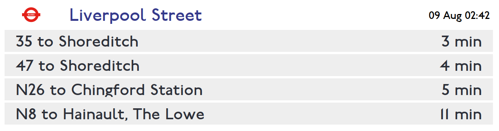

# Departure Board
A Qt based autonomous/timed departure board for UK National Rail and Transport
for London Busses. Uses [OpenLDBWS](https://lite.realtime.nationalrail.co.uk/OpenLDBWS/) and
[TfL API](https://api-portal.tfl.gov.uk/api-details#api=StopPoint) for data.

Configured by opening `config.json` from working directory. See `config.json.example`.

# setup
1. create venv
2. activate venv
3. install requirements.txt
4. `cp config.json.example config.json`
5. `python src/ui.py`

Script `setup.sh` will do steps 1-4 for you